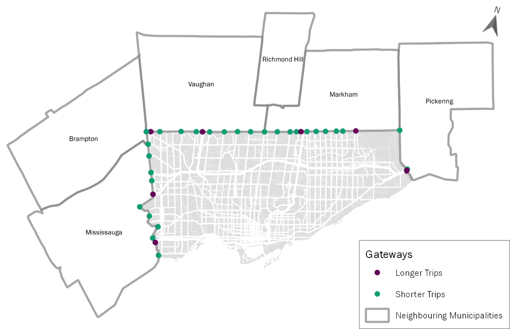

# bdit_trip_router

Routing trips from Origin to Destination through our traffic network. This work
was originally developed in order to estimate volumes of Private Transportation
Company (PTC) vehicles on the road network for our Transportation Impacts of
Vehicle-for-Hire Report
([pdf](https://www.toronto.ca/wp-content/uploads/2019/06/96c7-Report_v1.0_2019-06-21.pdf)).

## How to Use

### Set Up pgRouting

Check out the [Installation
Instructions](http://docs.pgrouting.org/latest/en/pgRouting-installation.html).
On an AWS RDS we just add the extension by running `CREATE EXTENSION pgrouting;`.

### Prepare Traffic Data

In this case we used HERE traffic data. See [these
instructions](https://github.com/CityofToronto/bdit_data-sources/tree/master/here#routing-with-traffic-data)
for how we prepared the traffic data for pgRouting.

### Transform Trip Data

The trip data's origin and destinations are tagged to [City of Toronto
centreline
intersections](https://open.toronto.ca/dataset/intersection-file-city-of-toronto/)
or, if outside the city, to a municipality ID. The `mat_view_routing_*.sql`
`MATERIALIZED VIEW`s find the nearest node in the [HERE
network](https://github.com/CityofToronto/bdit_data-sources/tree/master/here#routing-with-traffic-data)
for each intersection, below are the relevant joins:

```sql
JOIN ptc.pickup_intersections_new origint ON origint.int_id = trip_data_clean.pickup_gc_intersection_id
LEFT JOIN LATERAL ( SELECT z.node_id AS source
    FROM here_gis.zlevels_18_3 z
        JOIN here.routing_streets_18_3b USING (link_id)
    WHERE z.intrsect::text = 'Y'::text
    ORDER BY (z.geom <-> origint.geom)
    LIMIT 1) origin_nodes ON TRUE
JOIN ptc.pickup_intersections_new destinint ON destinint.int_id = trip_data_clean.dropoff_gc_intersection_id
LEFT JOIN LATERAL ( SELECT z.node_id AS target
    FROM here_gis.zlevels_18_3 z
        JOIN here.routing_streets_18_3b USING (link_id)
    WHERE z.intrsect::text = 'Y'::text
    ORDER BY (z.geom <-> destinint.geom)
    LIMIT 1) dest_nodes ON TRUE
```

- `origint` and `destinint` are aliases to look up the intersection geometries
- the `LEFT JOIN LATERAL () ON TRUE` find the closest node using
  `ORDER BY (z.geom <-> destinint.geom)` and `LIMIT 1`

#### Trips to/from Other Municipalities

For trips entering or leaving the City's boundaries, it was necessary to create
"gateways", or nodes representing the point a trip crossed the municipal
boundary. Depending on the length of the trip, the gateway would either be a
node on a highway (for longer trips) or a node on a highway or arterial (for
shorter trips, which would take a direct route over a faster highway link). You
can see the set of gateways for the six nearest municipalities in the image below.



### Running `pgr_dijkstra`

Routing was implemented in a `sql` function that ran for a given 5-minute bin,
see [`sql/function_route_trips.sql`](sql/function_route_trips.sql).

Unfortunately, the many-to-many implementation of `pgr_dijkstra` is actually
all-to-all. So the implementation routes all origins to all destinations, not
each trip's origin to its destination. It is necessary after to filter pairs of
start node and destination node to be actual OD pairs.

Due to memory errors in running `pgd_dijkstra` on the RDS, these
implementations had to be limited to a particular size of `O x D`. This was
done by assigning a sequential `id` to each trip and then using integer
division with `GROUP BY id/250` when aggregating origins and destinations into
arrays of `sources[] and targets[]`

```sql
(SELECT array_agg(source_id)::INT[] as sources,
        array_agg(target_id)::INT[] as targets
    FROM (SELECT dense_rank() OVER(ORDER BY ptctripid) as id, src.vertex_id  AS source_id, trg.vertex_id AS target_id
        FROM ptc.%I
        INNER JOIN distinct_nodes src ON src.node_id = source
        INNER JOIN distinct_nodes trg ON trg.node_id = target
        WHERE pickup_datetime >= %L::TIMESTAMP
                AND pickup_datetime < %L::TIMESTAMP + Interval '5 minutes'
        ) sample
GROUP BY id/250 ) ods
```

`pgr_dijkstra` was called using a `LATERAL` query so that it could refer to the
results of the `ods` sub-query:

```sql
LATERAL pgr_dijkstra('SELECT id, source, target, cost FROM here.get_network_for_tx_b('''||%L||''', TRUE)', sources, targets, TRUE) routing_results
```

And then the results were joined back to the actual trips based on origin and
destination:

```sql
INNER JOIN( --...
          ) trips ON source = start_vid AND target = end_vid
```

### Batch processing

In order to speed up and automate processing, the `ptc.route_trips_5min()`
function was called from Python (see [`py/route.py`](py/route.py)). It was possible to use the `concurrency` tools
to have multiple threads calling the database, thus allowing the RDS to be
using multiple CPUs to do this processing. Beware, error handling with
`concurrency` is pretty opaque.

`psycopg2`'s `ThreadedConnectionPool` was used to handle the connections to the
RDS by defining min, max, and credentials.

`times` is defined as an array of tuples `(route_tx, from_table, to_table)`
which are the time bin to be routed and the `MATERIALIZED VIEW` from which the
data is to be pulled and the `to_table` in which to insert it. In order to schedule multiple days of processing, for example,
over the weekend, different tables of data were allowed to be specified.

A python function `route_for_bin(bin, from_table, to_table)` was defined to be
parallelized. The
function gets a connection from the `ThreadedConnectionPool` `TCP` using
`TCP.get_conn()` and then executes the SQL function to route data discussed
above. When the function completes, the function returns that connection to the
connection pool before exiting so that another routing task can use it.

Tasks are pulled asynchronously from the `times` array and passed to free
"workers" using `executor.submit()` from within the `with ThreadPoolExecutor`
context manager. `executor.submit()` takes a function as its first parameter
and then an arbitrary set of arguments to be passed to that function when
executed and returns a `task_id`. This is created as a dictionary of the form
`{task_id: tx}` in order to log which time_bin was completed successfully.

```python
#Multi-threading woo! Make sure max_workers matches the second parameter of ThreadedConnectionPool()
with ThreadPoolExecutor(max_workers=6) as executor:
    tasks = {executor.submit(route_for_bin, tx, from_table, to_table): tx for tx, from_table, to_table in times}
```

`as_completed()` takes a dictionary with keys of task_ids and yields them as an iterator
when they are completed, which is how completed tasks get logged:

```python
for task_num in as_completed(tasks):
        logger.info('routing complete for: {}'.format(tasks[task_num]))
```
